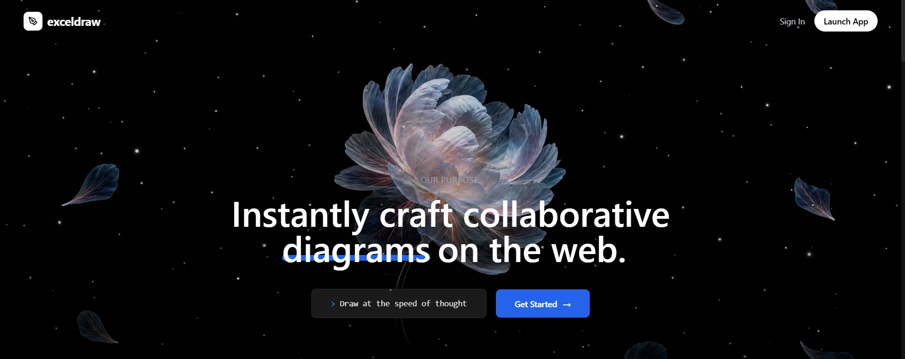

<p align="center">
  
</p>

<div align="center">
  <p align="center">
    <a href="https://excel-draw-excel-front.vercel.app/"></a>
    
    
    
    
    
  </p>
  
  <h2>✨ Instantly craft collaborative diagrams on the web ✨</h2>
  <p>Draw at the speed of thought with an infinite, zooming workspace built for teams.</p>
</div>

<br/>

<div align="center">
  <a href="https://excel-draw-excel-front.vercel.app/">
    <!-- NOTE: The image won't show until you place 'landing.png' inside the 'docs' folder and commit it! -->
    
  </a>
</div>

<br/>

<table align="center" border="0" width="100%">
  <tr>
    <td width="50%" valign="top">
      <h3 align="center">🚀 Key Features</h3>
      <ul>
        <li>♾️ <b>Infinite Canvas:</b> A seamless workspace where your ideas can blossom without boundaries.</li>
        <li>⚡ <b>Real-Time Sync:</b> Custom WebSocket implementation for instant multi-user collaboration.</li>
        <li>🎨 <b>Cinematic UI:</b> Glassmorphism, deep dark-mode, and fluid Framer Motion animations.</li>
        <li>🔒 <b>Team Workspaces:</b> Create secure rooms, share links, and draw together.</li>
        <li>📦 <b>Monorepo Power:</b> Engineered with Turborepo for massive scalability.</li>
      </ul>
    </td>
    <td width="50%" valign="top">
      <h3 align="center">🛠️ Tech Architecture</h3>
      <ul>
        <li><b>Frontend:</b> Next.js 15, React 18, Tailwind, Radix UI</li>
        <li><b>State & Motion:</b> Zustand, Framer Motion</li>
        <li><b>Backend API:</b> Node.js, Express</li>
        <li><b>Real-time Engine:</b> WebSockets Server</li>
        <li><b>Data Layer:</b> Prisma ORM, PostgreSQL</li>
      </ul>
    </td>
  </tr>
</table>

<br/>

## 🌌 The Ecosystem

> *ExcelDraw is structured as a modern monorepo, separating frontend, backend, and real-time concerns into a highly optimized workspace.*

<div align="left">
<pre>
ExcelDraw/
├── <b>apps/</b>
│   ├── excel_front   <i>— Next.js App Router (The Canvas UI)</i>
│   ├── http-backend  <i>— Express REST API (Auth & Rooms)</i>
│   └── websockets    <i>— Realtime Server (State Synchronization)</i>
└── <b>packages/</b>
    ├── ui            <i>— Radix & Tailwind shared components</i>
    ├── database      <i>— Prisma schema & PostgreSQL connection</i>
    └── common        <i>— Zod schemas & shared types</i>
</pre>
</div>

<br/>

## 🏎️ Ignition

Follow these steps to spin up the entire ecosystem on your local machine.

```bash
# 1. Clone the repository
git clone https://github.com/sanyamhbtu/ExcelDraw.git

# 2. Install dependencies via pnpm (vital for monorepos)
pnpm install

# 3. Setup environment and push the database schema
cp .env.example .env
cd packages/database && pnpm prisma db push

# 4. Ignite all packages and apps simultaneously
pnpm dev
```

<br/>

<p align="center">
  <a href="https://excel-draw-excel-front.vercel.app/">
    
  </a>
</p>

<p align="center">
  
</p>
